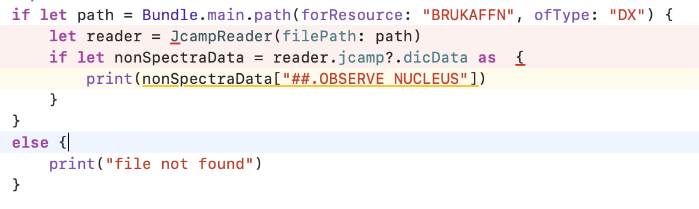
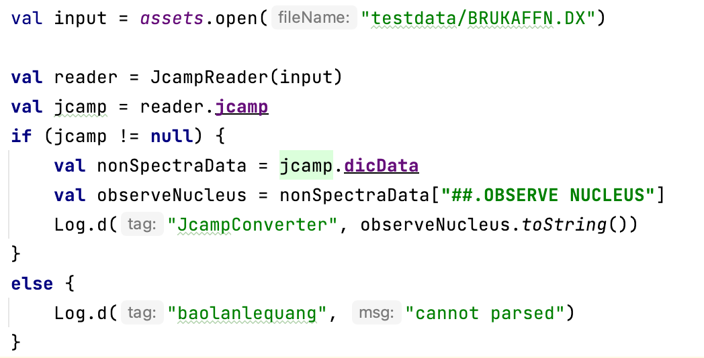

# Abstract
Despite much open-source software being developed for scientists, the lack of open-source tools in mobile devices is quite large. Because most of the scientific tools are running on PC or web pages, it needs to develop a set of scientific tools that can be running on mobile devices such as smartphones and tablets.

This paper introduces an open-source converter tool that converts data in JCAMP-DX file to plain spectra data in Android and iOS.

The results of this paper are native dependency libraries written in Kotlin and Swift for Android and iOS, respectively.

# Introduction
In 2015, European Commission started the new view about open science. Therefore, the European Open Science Cloud (EOSC) was created as a place to store and share research data through European countries [@eoss]. Following this decision, the German government founded NFDI (German National Research Data Infrastructure) Association in 2020 with the aim is make research data is available and shareable through the German scientific community [@ndfi].

In terms of that, NDFI4Chem project was founded with the purpose is digitalize chemical research data. One of the main tasks is developing an electronic lab book for chemists, named Chemotion ELN [@tremouilhac2017chemotion]. In Chemotion ELN, chemists can upload their analytical data file to view and project data. However, it is a web-based application, hence it is hard to process the data on smartphones or tablets in terms of UI/UX. To fill this gap, there is a need to implement another part to allow scientists easy process their data on mobile devices. Although this is needed, the is a lack of tools, especially open-source ones, for mobile environments.

Because analytical data are stored in Chemotion ELN under JCAMP-DX standard, the aim of this paper is focus developing an open-source library to convert spectra data in JCAMP-DX files to normal spectra. The results of this paper can be used to implement analytical data processing software on mobile devices in the future.

The parsing and reading data in JCAMP-DX file is described in section \ref{sec:parsing} and the results are shown in section \ref{sec:results}. A brief of JCAMP-DX standard is written in section \ref{sec:jcamp}. Section \ref{sec:using} mentioned where is the library can be retrieved while section \ref{limitation} discusses limitations and future works.

# JCAMP-DX \label{sec:jcamp}
JCAMP-DX, which is a standard format in terms of exchanging infrared spectra between different devices, was first developed by McDonald et al. [@mcdonald1988jcamp]. JCAMP-DX was named under The Joint Committee on Atomic and Molecular Physical Data (JCAMP). JCAMP-DX files are human-readable in ASCII text files, therefore they can be read, modified easily by a human.

JCAMP-DX was improved for stored NMR data in 1993 [@davies1993jcamp] and recommended by International Union of Pure and Applied Chemistry (IUPAC) in 1999. [@lampen1999extension]

## Basic structure of JCAMP-DX file
The specific JCAMP-DX structure is described in [@mcdonald1988jcamp] and [@lampen1999extension]. This section only describes the very basics of JCAMP-DX files.

The structure of one JCAMP-DX file is separated into two parts, the non-spectra part, and the spectra part.

Both non-spectra and spectra parts are wrapped by *BLOCK*, each *BLOCK* may have outer *BLOCK*. *BLOCK* start at *\#\#TITLE=* and end at *\#\#END=*.

Table \ref{example_block} shows example content of a BLOCK in JCAMP-DX file.

+:-------------------------------------:+
| \#\#TITLE= Isobutylacrylat 1 ul\      |
| \#\#JCAMP-DX= 4.24\                   |
| \#\#DATA TYPE=INFRARED SPECTRUM\      |
| \#\#ORIGIN=\                          |
| \#\#OWNER=\                           |
| \#\#DATA PROCESSING= SMOOTHING= none;\|
| \#\#XUNITS= 1/CM\                     |
| \#\#YUNITS= TRANSMITTANCE\            |
| \#\#XFACTOR=1.00\                     |
| \#\#FIRSTX=4000.00\                   |
| \#\#LASTX=700.00\                     |
| \#\#DELTAX=-1.00\                     |
| \#\#NPOINTS=3301\                     |
| \#\#YFACTOR=0.0001\                   |
| \#\#MINY=0.8631\                      |
| \#\#MAXY=1.0189\                      |
| \#\#FIRSTY=1.0160\                    |
| \#\#XYDATA= (X++(Y..Y))\              |
| 4000 +10160+10159+10159+10158+10158\  |
| 3989 +10153+10154+10154+10154+10154\  |
| 3978 +10155+10155+10156+10156+10155\  |
| ....\                                 |
|                                       |
| \#\#END=\                             |
+=======================================+
: Example of BLOCK \label{example_block}

## Non-spectra data
The official name of non-spectra data is *LABELED-DATA-RECORDS*. In JCAMP-DX file, non-spectra start with special characters shown in Table \ref{special_char_non_spectra}.

+:-----+--------------------------------:+
| \#\# | Starting of a labeled data \    |
+------+---------------------------------+
| \$\$ | Starting of a comment \         |
+------+---------------------------------+
| \$   | User defined label data \       |
+=======================================+
: Special characters indicate non-spectra data \label{special_char_non_spectra}

## Spectra data
Each line of spectra data starts with numerical value, followed by ASCII characters. Spectra data are compressed data. The original spectra data are compressed as one of *AFFN*, *PACKED (PAC)*, *SQUEEZED (SQZ)*, *DIFFERENCE (DIF)*, *DUPLICATE SUPPRESSION (DUP)*, *DIFDUP* formats or a combination of them. Table \ref{pseudo_digit} showed the code of these compression forms.

+:--------------------+---+---+---+---+---+---+---+---+---+--:+
| ASCII digits        | 0 | 1 | 2 | 3 | 4 | 5 | 6 | 7 | 8 | 9 |
+---------------------+---+---+---+---+---+---+---+---+---+---+
| Negative SQZ digits |   | a | b | c | d | e | f | g | h | i |
+---------------------+---+---+---+---+---+---+---+---+---+---+
| Positive SQZ digits | @ | A | B | C | D | E | F | G | H | I |
+---------------------+---+---+---+---+---+---+---+---+---+---+
| Negative DIF digits |   | j | k | l | m | n | o | p | q | r |
+---------------------+---+---+---+---+---+---+---+---+---+---+
| Positive DIF digits | \%| J | K | L | M | N | O | P | Q | R |
+---------------------+---+---+---+---+---+---+---+---+---+---+
| SQZ digits          |   | S | T | U | V | W | X | Y | Z | s |
+=============================================================+
: Pseudo-digit \label{pseudo_digit}

# Related works
Since JCAMP-DX has developed, this standard is used in both commercial and open-source software in terms of display spectrum and analysis spectrum. Two well-known software are Chemdraw [@chemdraw], MestRe nova [@willcott2009mestre]. Various other software is used to display and process NMR in JCAMP-DX standard were developed such as web-based open-source JSpecView [@lancashire2007jspecview], NMRium [@daviesa2021nmrium] and ChemSpectra [@huang2021chemspectra].

Some online databases that are also storing spectra under JCAMP-DX standard are Raman Open Database [@el2019raman], NPS Data Hub [@urbas2018nps].

Some open-source libraries are developed to process JCAMP-DX format. For instance, Javascript open-source library for web [@patiny_2023_8368258] are used in [@daviesa2021nmrium] and [@huang2021chemspectra]. One of the famous open-source software to project NMR spectra under JCAMP-DX format is nmrglue [@helmus2013nmrglue], which is a python module that can be used in terms of project NMR spectra data.

# Parsing algorithm \label{sec:parsing}

{width=90mm} \label{fig:algorithm}

Figure \ref{fig:algorithm} shows the algorithm used in *JcampConverter*. The algorithm of parsing spectra data is described as pseudo-code in Table \ref{table:parsing_spectra_algo}, the output of the parsing algorithm is plain spectra data.

Spectra data is a block of string lines. For each line, it will be going to scan process to figure out which compression style of the data. The converter then converts the scanned data into the plain spectra data in x and y coordinates.

| Step | Description                                                              |
|------|--------------------------------------------------------------------------|
| 1    | Initialize an empty array `storage_array`.                               |
| 2    | For each `line` in `Spectra`:                                            |
| 2.a  |    Set `scannedArray = ScanDUPandSQZ(line)`.                             |
| 2.b  |    For each `value` in `scannedArray`:                                   |
| 2.b.i|        Convert `value` to a double: `result = ConvertToDouble(value)`.   |
| 2.b.ii|       Add `result` to `storage_array`.                                  |
| 3    | Return `storage_array`.                                                  |
: Parsing spectra data algorithm \label{table:parsing_spectra_algo}

# Results \label{sec:results}
Two open-source libraries were developed and released under MIT license. Kotlin [@kotlinlang]} and Swift [@swiftlang] programming languages were used to develop two separate libraries for Android and iOS environments, respectively. Hence, they will be used in the development of native applications.

## Structure of parsed data

{width=50%} \label{non_spectra_ios}
{width=50%} \label{non_spectra_android}

## Non-spectra data
All non-spectra parts of JCAMP-DX's content are stored in Dictionary and HashMap data structures of iOS and Android, respectively. Therefore, these data can be retrieved by key and value. For instance, Figures \ref{fig:non_spectra_ios} and \ref{fig:non_spectra_android} showed example how to retrieve value *OBSERVE NUCLEUS* from file *BRUKAFFN.DX* in dataset [@jcamptestdata] in iOS and Android environments, respectively.

## Spectra data
Spectra data are stored in an array of xValues and yValues. When the spectrum is NMR spectrum, imaginary and real data are determined by a property called *isReal*.

## Test with test data \label{test_with_data}
Twenty files were used to test both platforms [@lanlejcamptestdata]. It means 9 NMR spectra, 3 mass spectra, 5 infrared spectra, 2 ion mobility spectra, and one NMR peak assignment were used to validate results after converting.

In term of validation parsing values, four factors *NPOINTS*, *FIRSTX*, *LASTX*, *FIRSTY* were used. 

Only NMR peak assignments returned the wrong value, this is a limitation and will be discussed in Section \ref{limitation}.

# How to use JcampConverter \label{sec:using}
## iOS
*JcampConverter* are released as a library at CocoaPods [@cocoapods]. Therefore, all scientists and software engineers can integrate this library into their research or products by using Cocopods.

## Android
*JcampConverter* for Android is released as a library at JitPack [@jitpack] and it can be used in any Android native application.

Since this library is released under MIT license, the source code can be modified by forking from Github repository \cite{R10} and \cite{R12}, for iOS and Android respectively.

# Limitations and future works \label{limitation}
## Limitations
*JcampConverter* currently can only process spectrum data in one of format forms *(X++(Y..Y)*, *(X++(R..R)*, *(X++(I..I)*, *(XY..XY)*.

The library was developed by only one programmer, therefore the bugs are unavoidable.

## Future works
Despite limitations, *JcampConverter* is the first open-source library for reading JCAMP-DX standard on mobile devices. In the mobility era, the result from this paper can be used to develop analytic tools as [@huang2021chemspectra], but on mobile devices. It also can be modified and used in terms of implementing education applications on smartphones.

# References